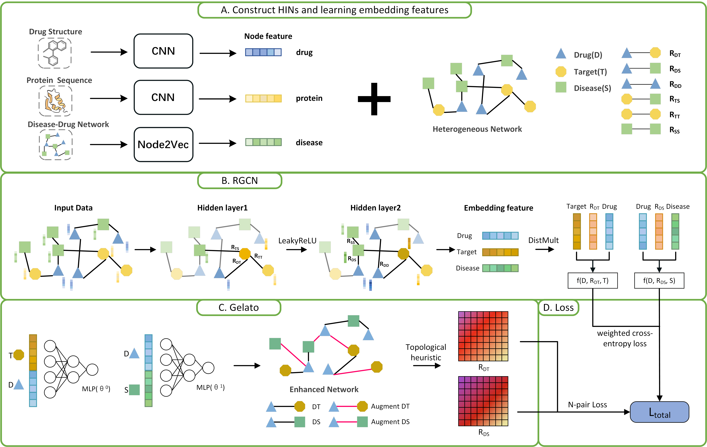

# RGGE-DTD

RGGE-DTD is a model based on RGCN and Gelato for predicting novel DTIs and DDAs.



# Requirements

The project is written in Python 3.7, and all experiments were conducted on a Windows server with an Intel 13th Gen Core i7-13700KF (3.44GHz, 64G RAM) and Nvidia RTX 4080s GPU (16G GPU RAM). For a faster training process, training on a GPU is necessary, but a standard computer without a GPU also works (though it will consume much more training time). We recommend the following hardware configuration:  

- RAM= 16G
- VRAM >= 16G  

All implementations of RGGE-DTD are based on PyTorch and PyTorch Geometric. RGGE-DTD requires the following dependencies:

- python == 3.10.10
- numpy == 1.24.3
- pandas == 2.2.2
- gensim==4.3.3
- torch == 2.5.0+cu124
- torchvision==0.20.0+cu124
- torchaudio==2.5.0+cu124
- torch_geometric == 2.6.1

# Input Data

## Luo/directory

- `drug.txt`: list of drug names
- `protein.txt`: list of protein names
- `disease.txt`: list of disease names
- `drug_smiles.csv`:Drug names and corresponding SMILES
- `protein_fasta.csv` :Target UniProt ID and amino acid sequence
- `drug_dict_map`: a complete ID mapping between drug names and DrugBank ID
- `protein_dict_map`: a complete ID mapping between protein names and UniProt ID
- `drug_target.dat` 	: Index list and binary association scores of the Drug-Target interaction matrix
- `drug_dis.dat` 	: Index list and binary association scores of the Drug-Disease association matrix
- `drug_drug.dat` 		: Index list and binary association scores of the Drug-Drug interaction
- `protein_dis.dat` : Index list and binary association scores of the Protein-Disease association matrix
- `pro_pro.dat` : Index list and binary association scores of the Protein-Protein interaction  matrix

# Run RGGE-DTD

Obtain the preprocessing file and execute the following command.

```
python preprocess.py
```

Run the RGGE-DTD model and execute the following command.

```
python main.py
```

# Optimize with optuna hyperparameters

First, install the Optuna package
```bash
pip install optuna == 4.3.0
```
Then navigate to the Optuna folder and execute the following command:
```bash
python findBestHP.py
```

# Citing

If you find our work helpful in your own research, please consider citing our paper:

```
@article{xxxx,
  title={xxxxxxxxxxxxxxxxx},
  author={xxxxxxxxxxxxxxxxxxx},
  journal={xxxxxx},
  volume={xx},
  number={xx},
  pages={xxxxxx},
  year={xxxxxx},
  publisher={xxxxxxxxxxxxxxxxx}
}
```

# Contacts

If you have any questions or comments, please feel free to email xxxxxx(1234567890@gmail.com).

